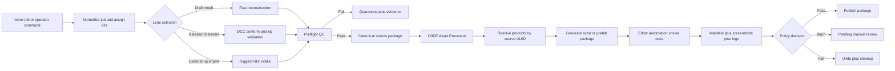

# Architecture

The target system is a two-tier production pipeline:

- **Draft lane**: fast iteration for idea-to-preview velocity. This lane can use TripoSR or local reconstruction flows, spawn mesh entities, and capture smoke proof quickly.
- **Release lane**: canonical packaging and publication. This lane resolves O3DE products by source identity and product type, runs QC, writes evidence bundles, and publishes prefab/actor outputs with rollback support.

The success condition must move from:

- "spawn succeeded"

to:

- "release package published with manifest, evidence, validation, and rollback."

This change prevents fragile one-off outputs from being mistaken for production-ready deliveries.

