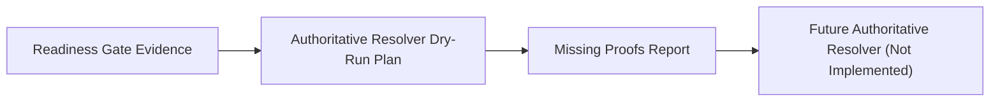

# Authoritative Resolver Dry-Run Contract

This document defines future requirements for write-capable product resolution in the M.A.X.I.N.E. O3DE pipeline.

Current implementation remains read-only. No current implementation is authorized to write resolved products.

## Purpose

This contract defines what evidence must exist before any future code may write resolved product records.

## Current Evidence Stack

1. product contract recording
2. filesystem evidence probing
3. AP metadata source discovery
4. AP DB schema inspection
5. source/product row mapping
6. source identity candidate matching
7. product candidate matching
8. product file existence validation
9. resolver readiness gate

## Required Future Authoritative Checks

- source identity proof
- expected product type proof
- product file existence proof
- AP job-state proof
- Asset Processor job success proof
- platform proof
- product freshness proof
- product identity proof
- no safety violation proof

## Next Missing Proof Contract

The next contract slice is AP job-state proof extraction from read-only row-mapping evidence.
This contract must remain non-authoritative and must not resolve products.

After AP job-state proof, the next missing proof contract is read-only platform proof extraction from candidate product/job/path evidence.

## Forbidden Writes Until All Checks Exist

- no `manifest.o3de.products.resolved = true`
- no product Asset IDs
- no prefab publication
- no entity spawn
- no cache cleanup

## Flow

