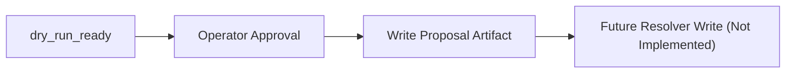

# Authoritative Resolver Write Protocol

## Purpose

This document defines the future write-capable resolver protocol for M.A.X.I.N.E. product resolution records.

The protocol defines required gates, approval requirements, and exact target manifest fields that a future authoritative resolver may write.

## Non-goal

No write-capable implementation is included in this slice.

- no runtime resolution writes
- no product Asset ID writes
- no publication/spawn actions

## Required Preconditions

Before any future write-capable resolver step can execute, all preconditions must be true:

- authoritative dry-run plan status is `dry_run_ready`
- all required proof IDs are satisfied
- explicit operator approval artifact is present and valid
- target platform is explicit
- write target fields are known and predeclared

## Proposed Future Write Fields

The following manifest fields are the proposed write targets for a future authoritative resolver:

- `manifest.o3de.products.resolved`
- `manifest.o3de.products.resolution_mode`
- `manifest.o3de.products.resolved_at_utc`
- `manifest.o3de.products.source_identity`
- `manifest.o3de.products.resolved_products[]`
- `manifest.o3de.products.proof_refs`
- `manifest.o3de.products.operator_approval`

## Required Operator Approval Fields

Any future write event requires a complete operator approval object with:

- `approval_id`
- `approved_by`
- `approved_at_utc`
- `approval_reason`
- `approved_plan_id`
- `approval_scope`

## Forbidden Without Approval

The following remain forbidden until operator approval is present and validated:

- `resolved = true`
- Asset ID claims
- prefab publication
- entity spawn
- product promotion

## Flow

